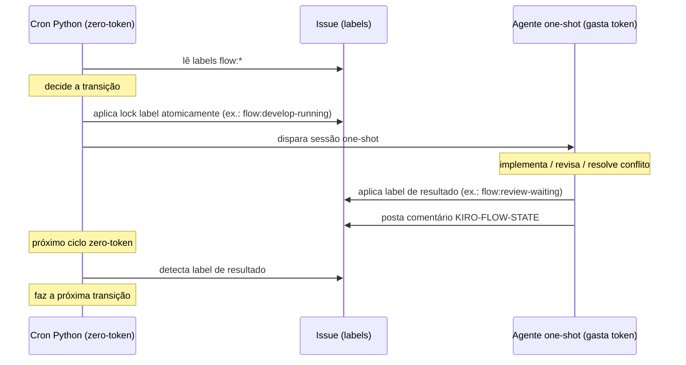

# Fluxo da esteira (KiroCrew Flow)

Orquestração de esteira de desenvolvimento sobre o **Kiro Crew**. O motor é
**single-flow, ledger-driven**: uma cron única (`flow-single`, 60s) processa a
task ativa em O(1) — 1 query SQLite + 1 chamada de rede.

> **Regra inviolável: a automação NUNCA faz deploy.** Ela entrega o PR e encerra.
> Deploy é sempre manual. Merge é **manual por padrão** (`auto_merge: false` por
> repo; `auto_merge_on_approve: false` globalmente). Ative por repo via
> `auto_merge: true` no `squads/*.yaml`.

## Fluxo completo (estados do ledger)

```
BRIEFING → PLANNING_SPECS → PLANNING_REVIEW → DEVELOP_WAITING
         → REVIEW_WAITING
           → REVIEW_APPROVED → QA_WAITING → QA_APPROVED → DONE
           → REVIEW_REFUSED  (gate humano — terminal)
                                           → QA_REFUSED  (gate humano — terminal)
```

Modificadores que ainda influenciam o motor: `flow:blocked`, `flow:merge-conflict`.

**Regra chave:** toda reprovação humana (`REVIEW_REFUSED`, `QA_REFUSED`) é terminal
— o fluxo para e aguarda decisão manual. Sem dispatch automático após reprovação.

## Protocolo de comunicação cron ↔ agente

O motor é **ledger-driven**: o estado canônico vive no SQLite (`run_ledger`).
A comunicação com o agente one-shot é via **WORKFLOW_EXIT no JSONL da sessão**,
não mais via labels na issue.

```
Cron flow-single (zero token, 60s)
  → ledger.active()                    ← O(1): 1 query SQLite
  → provider.get_work_item()           ← 1 chamada de rede
  → ledger_tick.tick()

Estágio ATIVO (BRIEFING / PLANNING_SPECS):
  → dispatch_stage() → sessão one-shot
      Agente: executa trabalho
      Agente: publica WORKFLOW_EXIT: {"exit_status": "done"}
  → motor lê JSONL → ledger.advance(próximo_estado)

Estágio ESPERA (DEVELOP / REVIEW / QA):
  → motor observa sinal externo (PR aberto, review aprovado)
  → ledger.advance(próximo_estado) quando sinal chega
```

### Contrato do agente one-shot

Ao encerrar com **sucesso**, o agente DEVE publicar na última mensagem:

```
WORKFLOW_EXIT: {"exit_status": "done"}
```

O motor lê o JSONL de trás para frente e avança o estado conforme o mapeamento
de transições. Sem o `WORKFLOW_EXIT`, o motor não avança (estado fica em espera).

Ao encerrar por **bloqueio**, o agente publica:

```
WORKFLOW_EXIT: {"exit_status": "failed", "reason": "motivo"}
```

> **Legado (label-driven, até set/2026):** antes a comunicação era via labels
> `flow:*` na issue + comentário `KIRO-FLOW-STATE`. Esse mecanismo foi removido na
> PR #319. As labels `flow:*` ainda são aplicadas como espelho de visibilidade.

## Labels — duas dimensões

O modelo é **estado × modificador**. Um estado por vez; zero ou mais modificadores
sobrepostos. **Modificador de parada (`flow:blocked`) tem prioridade sobre o estado.**

### Estados (1 por vez, ordem canônica)

| Label | Significado | Quem age | Automatizado |
|---|---|---|---|
| `flow:briefing` | TL/PM criou demanda + briefing | 🧠 humano | Não |
| `flow:planning-specs` | Dev montando spec/critérios/sub-tasks | 🧠 dev | Parcial |
| `flow:planning-review` | Dev pediu revisão ao TL/PM | 🧠 TL/PM | Não |
| `flow:develop-waiting` | Aguardando agente pegar — **GATILHO** | 🤖 | Sim |
| `flow:develop-running` | Agente implementando | 🤖 | Sim |
| `flow:review-waiting` | PR aberta, aguardando reviewer | 🤖 | Sim |
| `flow:review-approved` | Reviewer aprovou | 🤖 | Sim |
| `flow:review-refused` | Reviewer reprovou — **gate humano** | 🧠 | Não |
| `flow:qa-waiting` | Aguardando QA | 🧠 | Não |
| `flow:qa-testing` | QA testando | 🧠 | Não |
| `flow:qa-approved` | QA aprovou — **gatilho merge** | 🤖 | Sim |
| `flow:qa-refused` | QA reprovou — **gate humano** | 🧠 | Não |
| `flow:done` | Concluído | — | Sim |

### Modificadores (0..N, sobrepõem)

| Label | Significado |
|---|---|\n| `flow:blocked` | Bloqueado — **para tudo** (prioridade sobre o estado) |
| `flow:merge-conflict` | PR com conflito de merge ou base desatualizada — cron resolve via rebase |

**Gatilho único:** só `flow:develop-waiting` faz a esteira agir. Tudo antes dela é humano;
tudo depois do PR também.

### Quem aplica cada label

| Label | Quem aplica | Quando |
|---|---|---|
| `flow:develop-waiting` | 🧠 humano | ao priorizar — **gatilho do cron** |
| `flow:develop-running` | 🤖 cron | ao despachar sessão dev (lock atômico) |
| `flow:review-waiting` | 🤖 agente (dev) | ao abrir PR e encerrar |
| `flow:review-running` | 🤖 cron | ao despachar reviewer (lock anti-loop) |
| `flow:review-approved` | 🤖 agente (reviewer) | ao aprovar o PR |
| `flow:review-refused` | 🤖 agente (reviewer) | ao reprovar — gate humano |
| `flow:qa-waiting` | 🤖 cron | após merge ou review-ok |
| `flow:qa-testing` | 🧠 QA | ao iniciar testes |
| `flow:qa-approved` | 🧠 QA | ao aprovar |
| `flow:qa-refused` | 🧠 QA | ao reprovar — gate humano |
| `flow:done` | 🤖 cron | após merge final |
| `flow:blocked` | 🧠 humano ou 🤖 agente | ao detectar bloqueio |
| `flow:merge-conflict` | 🤖 cron | ao detectar conflito de merge |

## Protocolo cron ↔ agente (duas camadas)

O sistema tem **duas camadas distintas** que nunca se chamam diretamente:

- **Cron Python (zero-token): orquestrador de estado.** Lê labels, decide a
  transição, aplica a label de lock atomicamente antes de despachar
  (ex.: `flow:develop-running`, `flow:review-running`), dispara a sessão e, no
  ciclo seguinte, detecta a label de resultado e faz a próxima transição.
- **Agente one-shot (gasta token): executor de trabalho.** Implementa, revisa ou
  resolve conflito, aplica a label de resultado ao terminar
  (ex.: `flow:review-waiting` ao abrir o PR, `flow:review-approved`/`flow:review-refused`
  após o review) e posta o comentário `KIRO-FLOW-STATE`.

As duas camadas se comunicam **exclusivamente via labels na issue** mais o
comentário `KIRO-FLOW-STATE`.



## Comunicação: só via labels (regra do agente)

Regra de steering do agente one-shot:

- O agente **NUNCA chama o cron diretamente.** Não existe callback, RPC ou
  espera ativa entre as camadas.
- Ao terminar, o agente **APENAS aplica a label de resultado** na issue
  (ex.: `flow:review-waiting` ao abrir o PR, `flow:review-approved`/`flow:review-refused`
  após o review) e **posta o comentário `KIRO-FLOW-STATE`**.
- A label de lock (`flow:develop-running`, `flow:review-running`) já foi aplicada
  atomicamente pelo cron/executor antes da sessão começar. O agente **não troca a
  label de lock**: só aplica a label de resultado no fim (ver `flow/prompts/develop_waiting.md`).
- O cron detecta a label de resultado no **próximo ciclo** zero-token e faz a
  transição de estado.

Isso mantém o gatilho único e os gates humanos intactos: o agente reporta resultado
via label, e é o cron (ou um humano, nos gates) que decide o passo seguinte.

## Como o motor dispara (arquitetura hexagonal)

O loop completo:

```
squads/*.yaml
    → SquadConfig.resolve_workflow(labels)  → template (feature/bug/hotfix/debt)
    → scan_candidates(config, provider, conn)  → zero token, SQLite cache
    → executor.decide(result, state_comment, squad)  → puro Python, sem I/O
    → deployment.run() executa a decisão:
        DISPATCH_DEV       → sessão one-shot (implementa + abre PR)
        DISPATCH_REVIEWER  → notifica que kiro-reviewer foi disparado
        DISPATCH_REWORK    → sessão dev de re-trabalho pós-rework humano (não automático)
        DISPATCH_CONFLICT_RESOLVER → sessão de resolução de conflito (rebase na branch feat/issue-N)
        MARK_CONFLITO      → aplica flow:merge-conflict na issue (PR com mergeable=CONFLICTING)
        NOTIFY_HUMAN       → avisa TL / Dev / QA pelo papel correto (gates humanos)
        BLOCK              → notifica bypass sem justificativa
        REBRAND            → atualiza labels (GATE 0 do hotfix)
        SKIP               → silêncio
```

### Crons por estágio

| Entrypoint | Estado alvo | Ação | Intervalo recomendado |
|---|---|---|---|
| `run_dev` | `flow:develop-waiting` | `DISPATCH_DEV` — implementa + abre PR | 600s (10 min) |
| `run_reviewer` | `flow:review-waiting` (sem `flow:review-running`) | `DISPATCH_REVIEWER` — code review | 300s (5 min) |
| `run_review_approved` | `flow:review-approved` | `MERGE_PR` → `flow:qa-waiting` | 120s (2 min) |
| `run_qa_approved` | `flow:qa-approved` | `MERGE_PR` → `flow:done` | 120s (2 min) |
| `run_merge` | `flow:review-approved` ou `flow:qa-approved` | `MERGE_PR` — ambos (depreciado) | 120s (2 min) |
| `run_conflito` | `flow:merge-conflict` | `DISPATCH_CONFLICT_RESOLVER` | 300s (5 min) |

### Crons do modo single-flow (opt-in — `single_flow: true`)

Só produzem ação quando `single_flow: true` na `deployment.config.yaml`. No modo
paralelo default (`single_flow: false`) estes crons são inócuos: os estados de
spec apenas notificam o humano. A regra single-flow leva **uma** task por vez do
briefing ao merge, com o `RunLedger` (SQLite local) como fonte de verdade do
"onde a task está".

| Entrypoint | Estado alvo | Ação | Intervalo recomendado |
|---|---|---|---|
| `run_briefing` | `flow:briefing` | `DISPATCH_BRIEFING` — sessão de briefing + 2 sub-tasks | 600s (10 min) |
| `run_planning` | `flow:planning-specs` | `DISPATCH_PLANNING` — monta spec (req+design+tasks) na Sub-task 1 | 600s (10 min) |
| `run_planning_review` | `flow:planning-review` | `ADVANCE_TO_DEVELOP` — Sub-task 1 aceita (fechada) → `flow:develop-waiting` | 300s (5 min) |

Aceite da Especificação = **Sub-task 1 fechada** (uniforme GitHub/Jira). O
`run_planning_review` lê as sub-tasks via `IssueProvider.list_subtasks`, aplica o
gate puro `can_leave_planning`, e só então troca a label — entregando a task à
esteira de `run_dev` em diante, que permanece intocada.

## Lock anti-loop: `flow:review-running`

Uma análise por SHA. O cron/executor aplica `flow:review-running` atomicamente **antes**
de despachar o reviewer (lock aplicado pela camada zero-token, não pelo agente). Quando o
review termina:
- Aprovado → move para `flow:review-approved` (remove `flow:review-waiting,flow:review-running`)
- Reprovado → move para `flow:review-refused` (gate humano — não redespacha automaticamente)

Quando o dev faz novo push, `flow:review-running` é invalidado (novo SHA) e a próxima varredura
dispara nova análise.

## Travas de segurança

- `auto_dispatch=false` por padrão (só avisa até você confiar).
- `max_concurrent_tasks` (default 2) — cap por número de issues em `flow:develop-running` no scan.
- `max_turns_per_task` — teto duro por sessão.
- Worktree isolado + ordem de nunca tocar outros worktrees/branches.
- **Nenhum deploy automatizado** — trava de produto, não de config.
- **Gates humanos invioláveis:** `review-refused` e `qa-refused` NUNCA despacham automaticamente.
  Apenas notificam o TL e aguardam decisão manual.

## Migração crewflow:* → flow:*

| crewflow | flow |
|---|---|
| `crewflow:spec` | `flow:briefing` |
| `crewflow:ready` | `flow:planning-specs` |
| `crewflow:todo` | `flow:develop-waiting` |
| `crewflow:dev` | `flow:develop-running` |
| `crewflow:review` | `flow:review-waiting` |
| `crewflow:review-ok` | `flow:review-approved` |
| `crewflow:review-fail` | `flow:review-refused` |
| `crewflow:qa` | `flow:qa-waiting` |
| `crewflow:done` | `flow:done` |
| `crewflow:blocked` | `flow:blocked` |
| `crewflow:conflito` | `flow:merge-conflict` |
| `crewflow:reviewed` | `flow:review-running` (lock interno) |
| `crewflow:running` | eliminado (absorvido em `flow:develop-running`) |
| `crewflow:changes-requested` | eliminado (substituído por `flow:review-refused`) |

Use `scripts/setup-flow-labels.sh` para criar labels no novo namespace e
`scripts/migrate-labels.sh` para migrar issues existentes.

> Depende do Kiro Crew rodando — é uma receita/plugin, não um app standalone.
