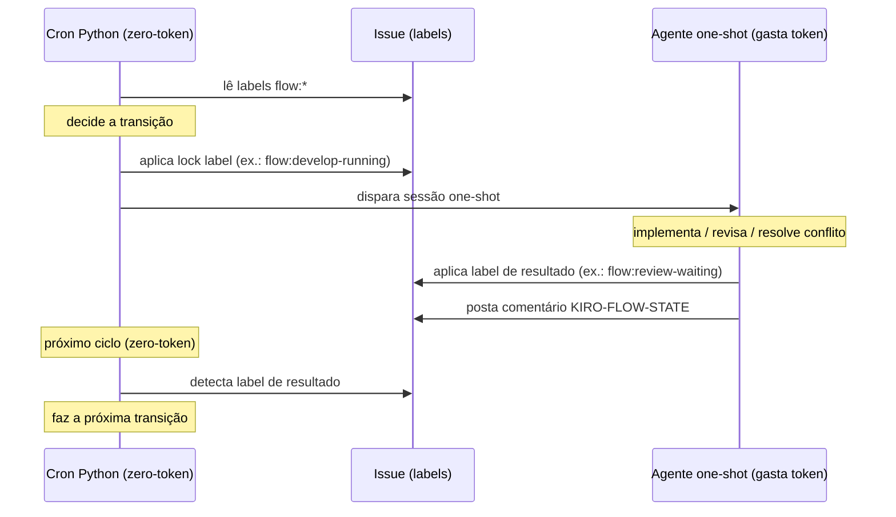

# kirocrew-flow

**KiroCrew Flow** — orquestração de esteira de desenvolvimento multi-squad sobre o
**[Kiro Crew](https://github.com/kirodotdev)**: os fluxos de trabalho são **grafos**,
o estado de cada task vive em **labels `flow:*`** na própria issue, e o polling
é **zero-token**.

> ⚠️ **Não é standalone.** Depende do Kiro Crew rodando na máquina: dispara sessões
> de agente via o webhook do dashboard (`POST /api/hooks/agent`) e usa o formato de
> *cron de script* do Kiro Crew. Veja [Dispatch de sessões](#dispatch-de-sessões-webhook) abaixo.

## Princípios

1. **A issue É o estado.** Label = estado atual, comentário = histórico auditável.
2. **Zero-token no polling.** O scan é Python puro — token só gasto quando há trabalho real.
3. **Merge é manual por padrão.** A automação abre o PR e para. Nenhum deploy automatizado. Auto-merge é opt-in por squad config (`auto_merge_on_approve: true`).
4. **Gates humanos são invioláveis.** Aprovação de spec, review e QA são sempre de pessoas.
5. **Exceções são auditáveis.** O bypass do HML (hotfix direto pra PRD) exige justificativa e é rastreado.

## Modelo de labels

Duas dimensões independentes.

### Estados — 1 por vez, nesta ordem

```
flow:briefing → flow:planning-specs → flow:planning-review → flow:develop-waiting
  → flow:develop-running → flow:review-waiting → flow:review-approved
  → flow:qa-waiting → flow:qa-testing → flow:qa-approved → flow:done
```

> Labels de estado legadas (`crewflow:spec`, `crewflow:ready`, `crewflow:todo`, etc.)
> foram deprecadas. Use `setup-flow-labels.sh` para criar o namespace `flow:*` em novos repos.

### Modificadores — 0..N, sobrepõem ao estado

| Label | Significado |
|---|---|
| `flow:blocked` | Para tudo (prioridade sobre o estado) |
| `flow:merge-conflict` | PR com conflito de merge ou base desatualizada — cron resolve via rebase |

### Metadado crewflow:* (tipo de fluxo e prioridade)

`crewflow:feature` · `crewflow:bug` · `crewflow:hotfix` · `crewflow:debt`  
`crewflow:p1` · `crewflow:p2` · `crewflow:p3`

> `crewflow:blocked` é reconhecido pelo motor por compatibilidade com repos que já
> usam o namespace legado; o equivalente canônico é `flow:blocked`.

Aplique os estados num repo:
```bash
./scripts/setup-flow-labels.sh owner/repo
```

Aplique o metadado (tipo + prioridade):
```bash
./scripts/setup-labels.sh owner/repo
```

## Como funciona

```
squads/*.yaml → SquadConfig → scan_candidates() → executor.decide() → deployment.run()
```

1. `scan_candidates()` varre as issues por labels `flow:*` sem gastar token — compara hash do estado atual com o cache SQLite, e só processa o que mudou.
2. `executor.decide()` decide a ação (DISPATCH_DEV, DISPATCH_REVIEWER, NOTIFY_HUMAN, BLOCK, REBRAND ou SKIP) com base no template da squad e no estado da issue.
3. `deployment.run()` executa a ação: dispara sessão one-shot, notifica humano ou aplica rebrand de template.

A sessão one-shot **nunca mergeia e nunca faz deploy**. Ela entrega o PR em `flow:review-waiting` e encerra.

### Protocolo cron ↔ agente

O motor tem **duas camadas distintas** que nunca se chamam diretamente. Elas
se comunicam **exclusivamente via labels na issue** (e o comentário `KIRO-FLOW-STATE`):

- **Cron Python (zero-token): orquestrador de estado.** Lê as labels da issue,
  decide a transição, aplica a label de lock atomicamente antes de despachar
  (ex.: `flow:develop-running`, `flow:review-running`), dispara a sessão do agente
  e, no ciclo seguinte, detecta a label de resultado e faz a próxima transição.
- **Agente one-shot (gasta token): executor de trabalho.** Implementa, revisa ou
  resolve conflito, aplica a label de resultado ao terminar (ex.: `flow:review-waiting`
  ao abrir o PR, `flow:review-approved`/`flow:review-refused` após o review) e posta
  o comentário `KIRO-FLOW-STATE`.

```
cron Python (zero token)
  → lê labels → decide → aplica lock label → dispara sessão

agente one-shot (gasta token)
  → implementa/revisa → aplica label de resultado

cron Python (zero token)
  → detecta label de resultado → faz próxima transição
```

Nenhum dos dois chama o outro diretamente: comunicam-se **exclusivamente via labels na issue**.



### Dispatch de sessões (webhook)

Os crons de estágio que precisam acordar uma sessão de agente (`flow-develop-waiting`,
`flow-review-waiting`, `flow-merge-conflict`) despacham via **POST ao webhook do
dashboard** do Kiro Crew. Isso funciona nos crons `script`-based, cujo `ScriptContext`
não expõe `_port`/`_secret` do gateway (a causa raiz da issue #212, em que a label era
trocada mas nenhuma sessão era criada).

Duas variáveis de ambiente controlam o transporte (registre-as como **Secrets do cron**
no dashboard → Schedule → cron → Secrets):

| Variável | Default | Descrição |
|---|---|---|
| `KIROCREW_WEBHOOK_URL` | `http://localhost:5478/api/hooks/agent` | Endpoint do webhook do dashboard. |
| `KIROCREW_WEBHOOK_TOKEN` | *(vazio)* | Token Bearer do webhook configurado (Settings → Webhooks). Nunca versionado. |
| `KIROCREW_WEBHOOK_SECRET` | *(vazio)* | Signing secret do webhook (HMAC-SHA256). Nunca versionado. |

Quando `KIROCREW_WEBHOOK_TOKEN` está setado, o dispatch faz
`POST {KIROCREW_WEBHOOK_URL}` com header `Authorization: Bearer <token>`. Quando o token
está **vazio**, cai no comportamento legado de loopback interno (`POST /api/chat` com
`X-Internal-Secret`/`X-Session-Key`), preservando os crons `message`-based. O scan em si
continua **zero-token** — o webhook só é chamado quando há um candidato real na fila.

> **Secrets nunca vão no `deployment.config.yaml`**. Configure-os via variáveis de
> ambiente (ou Secrets do cron no dashboard). Veja [`deployment/.env.example`](deployment/.env.example) para a lista completa.

## Fluxos disponíveis (Fase 1)

| Template | Quando usar |
|---|---|
| `feature` (Versão C) | Feature nova. Review ANTES do QA, sequencial. |
| `bug` | Correção de bug. Mesma ordem da Versão C. |
| `hotfix` | Incidente em PRD. GATE 0 filtra o que é realmente urgente. |
| `debt` | Refatoração sem mudança de comportamento. TL aprova; QA valida equivalência. |

Diagramas em [`docs/diagramas/`](docs/diagramas/README.md).

## Setup

Pré-requisito: Kiro Crew rodando + `gh` autenticado (`gh auth status`).

### 1. Configure a squad

Crie `squads/minha-squad.yaml` com base em `squads/example.yaml`:

```yaml
id: minha-squad
name: Squad Exemplo
issue_provider: jira   # ou github
project: VGAT          # chave do projeto Jira
repos:
  - org/api-gateway2
  - org/api-subscription2
workflow_template: versao-c
routing:
  - match:
      labels:
        - crewflow:hotfix
    workflow: hotfix-flow
  - default: feature-flow
```

> **PyYAML (recomendado para routing complexo):** o parser embutido (`_mini_yaml`) suporta
> escalares, listas simples, mapeamentos de 1 nível, e listas de dicts — tanto no formato
> inline (`{labels: [...]}`) quanto multi-linha. Para garantir compatibilidade total com YAML
> arbitrário, instale PyYAML:
>
> ```bash
> pip install "kirocrew-flow[yaml]"
> # ou: pip install pyyaml
> ```
>
> Sem PyYAML o fallback cobre os casos de uso do squad config padrão.

### 2. Configure o cron

```bash
# SEMPRE usar o script de instalação — não copie manualmente
./scripts/install-cron.sh

# O script copia deployment.py, deployment/flow/, flow_auto_update.py,
# aplica o patch de sys.path e copia deployment.config.yaml (se não existir).
# Edite ~/.kiro/crew/crons/deployment.config.yaml com seus paths.
```

Se o App estiver instalado via `kirocrew app enable kirocrew-flow`, os crons são
registrados automaticamente pelo gateway ao habilitar o App (via `app.json`).
Para instalar manualmente ou atualizar os scripts instalados:

```bash
./scripts/install-cron.sh
```

**Crons registrados automaticamente pelo App (namespace `flow:*`):**

| Nome | Script | Intervalo | Estágio |
|---|---|---|---|
| `flow-develop-waiting` | `deployment/flow/dev.py:run` | 300s | `flow:develop-waiting` → implementa + PR |
| `flow-review-waiting` | `deployment/flow/reviewer.py:run` | 180s | `flow:review-waiting` → code review |
| `flow-review-approved` | `deployment/flow/review_approved.py:run` | 120s | `flow:review-approved` → merge → QA |
| `flow-review-refused` | `deployment/flow/rework.py:run` | 3600s | `flow:review-refused` → notifica TL |
| `flow-merge-conflict` | `deployment/flow/conflict.py:run` | 300s | `flow:merge-conflict` → rebase |
| `flow-qa-waiting` | `deployment/flow/qa_notify.py:run` | 600s | `flow:qa-waiting` → notifica QA |
| `flow-qa-approved` | `deployment/flow/qa_approved.py:run` | 120s | `flow:qa-approved` → merge → done |
| `flow-qa-refused` | `deployment/flow/qa_refused.py:run` | 3600s | `flow:qa-refused` → notifica TL+dev |

Para registrar manualmente (cron monolítico legado, todos os estágios em sequência):

```
cron_add(name="crewflow-scan", script="~/.kiro/crew/crons/deployment.py:run", every=600)
```

### 3. Aplique as labels

```bash
# Labels de estado (namespace flow:*)
./scripts/setup-flow-labels.sh owner/repo

# Labels de metadado (tipo de fluxo + prioridade, namespace crewflow:*)
./scripts/setup-labels.sh owner/repo
```

### 4. Comece no modo de aviso

Deixe `auto_dispatch: false` (só avisa). Quando confiar, mude para `true`.

## Estrutura do código

```
flow/
├── domain/      ← regras de negócio puras (sem I/O), testáveis sem mock
│   ├── state.py — Estado, Modificador, is_dispatchable()
│   └── gates.py — can_leave_spec(), triage_hotfix(), validate_hml_bypass()
├── ports/       ← contrato do provider (IssueProvider Protocol)
├── adapters/    ← GitHub e Jira (transport + normalization + client)
├── scan/        ← zero-token polling + cache SQLite
├── executor/    ← decide() por template (feature/bug/hotfix/debt)
├── audit/       ← comentário estruturado <!-- KIRO-FLOW-STATE -->
├── prompts/     ← templates MD editáveis por estágio (dev, reviewer, …)
└── config/      ← SquadConfig + workflow templates

deployment/      ← cron de script do Kiro Crew (driving adapter)
squads/          ← configurações de squad (*.yaml)
workflows/       ← templates de workflow (*.yaml)
resources/mermaid/ ← fonte dos diagramas (.mmd)
docs/            ← VISION.md, ARCHITECTURE.md, ROADMAP.md, diagramas/
```

Ver `.kiro/steering/arquitetura.md` para convenções de código e como adicionar um novo provedor.

### Editar o prompt de uma sessão one-shot

Os prompts ficam em `flow/prompts/`:
- `develop_waiting.md` — sessão de implementação (o agente que abre o PR)
- `review_waiting.md` — sessão de code review
- `merge_conflict.md` — resolução de conflito de merge

Edite o MD livremente. Placeholders usam `{{nome}}`. Se um placeholder referenciar
uma variável que o motor não fornece, o dispatch **falha explicitamente** (fail-closed)
em vez de mandar o prompt quebrado. Em caso de arquivo ausente, o motor usa o fallback
embutido em `deployment.py`.

> ⚠️ **Regra crítica — reinstale o cron após qualquer mudança em prompts ou deployment.py**
>
> Os templates (`flow/prompts/*.md`) são lidos em runtime, mas `deployment.py` é **copiado**
> para `~/.kiro/crew/crons/` na instalação. Um PR que adiciona `{{nova_var}}` a um template
> sem reinstalar o cron causa `PromptRenderError` em **todas** as issues do estágio afetado.
>
> ```bash
> ./scripts/install-cron.sh
> ```
>
> O CI detecta o descompasso **antes do merge** via `flow/tests/test_template_code_parity.py`.
> O cron detecta **em runtime** via `deployment.version` e notifica quando o script instalado
> diverge do repo.

### Comportamento do reviewer (`review_waiting.md`)

O agente reviewer valida o PR como **gate único** antes do approve:

1. **Lê o contexto completo** — issue, comentários da issue, diff do PR, comentários do PR.
2. **Verifica a pipeline de CI** — `gh pr checks` — o PR só pode ser aprovado com CI verde.
3. **Analisa o código** — corretude, testes, estilo e convenções do steering do repo.
4. **Decide com as três condições**: CI verde + zero comentários não resolvidos no PR + sem blockers técnicos.
5. **Posta o resultado completo nos DOIS lugares** — PR e issue — com: o que foi feito, o resultado, o link e todas as informações.
6. **Aplica `flow:review-running`** somente quando as três condições são satisfeitas. Com `auto_merge_on_approve: true` no squad config, o motor faz merge squash automático; sem a flag (default), para em `flow:review-running` aguardando merge manual.

## Desenvolvimento

```bash
# Lint
python3 -m ruff check flow/

# Testes + cobertura
python3 -m pytest flow/tests/ --cov=flow --cov-report=term-missing

# Tudo junto
python3 -m ruff check flow/ && python3 -m pytest flow/tests/ --cov=flow --cov-fail-under=75
```

630 testes, cobertura ≥75% (piso do CI), ruff limpo.

## Release Engineering

O KiroCrew Flow usa [semantic-release](https://semantic-release.gitbook.io) para
versionamento semântico automático.

### Como funciona

A cada push na branch `main`, o workflow `.github/workflows/release.yml`:

1. Roda o CI (lint + mypy + testes)
2. Analisa os commits desde a última tag para calcular o bump de versão:
   - `feat:` → **minor** (nova funcionalidade)
   - `fix:`, `perf:`, `refactor:` → **patch** (correção/melhoria)
   - `BREAKING CHANGE` no footer do commit → **major**
   - `docs:`, `test:`, `chore:`, `ci:` → sem release
3. Atualiza `app.json` e `pyproject.toml` com a nova versão via `scripts/prepare-release.py`
4. Gera/atualiza `CHANGELOG.md`
5. Cria a tag `vX.Y.Z` e a release no GitHub

Se nenhum commit elegível for encontrado (só `docs:`, `chore:`, etc.), o workflow
encerra silenciosamente sem criar release.

### Política de update (patch vs minor/major)

| Tipo de bump | Política | Ação no usuário |
|---|---|---|
| **patch** (`fix:`, `perf:`) | Update automático seguro | `kirocrew app update kirocrew-flow` aplica sem riscos |
| **minor** (`feat:`) | Notificação recomendada | Update manual — pode haver novas configurações opcionais |
| **major** (breaking change) | **Update manual obrigatório** | Pode exigir migração de `deployment.config.yaml` ou squads |

> O Kiro Crew invoca o hook `onUpdate` do `app.json` ao atualizar o app:
> ```bash
> pip install -e '.[dev,gateway]' && cd ui && npm run build && ./scripts/install-cron.sh
> ```
> O antigo cron `flow-auto-update` (git pull a cada 5 min) foi **removido** nesta versão.

### Tags de canal

| Tag | Branch | Uso |
|---|---|---|
| versão semântica (`v1.2.3`) | `main` | Release canônica |
| `stable` | branch `stable` (promoção manual) | Versão validada para produção |

Para promover uma versão para `stable`:
```bash
git checkout stable
git merge v1.2.3  # ou git reset --hard v1.2.3
git push origin stable
```

## Dry-run — inspecionar sem despachar

Antes de ativar o `auto_dispatch`, use o modo dry-run para validar o que o motor faria:

```bash
CREWFLOW_DRY_RUN=1 python3 deployment/deployment.py
```

Ou via config (`deployment.config.yaml`):

```yaml
dry_run: true
```

Saída esperada:

```
[DRY-RUN] ──────────────────────────────────────────
[DRY-RUN] 2 issue(s) processada(s) pelo scan
[DRY-RUN] Decisões (nenhuma será executada):

[DRY-RUN] owner/repo#73 → DISPATCH_DEV (template via executor) — [repo] feat: dry-run
[DRY-RUN] owner/repo#74 → NOTIFY_HUMAN tl — [repo] Fix: aguarda gate-tl

[DRY-RUN] ── Nenhuma sessão despachada, label alterada ou notificação enviada. ──
```

Garantias do modo dry-run:
- O scan roda normalmente (lê issues, executa o executor, decide ações)
- `_dispatch()` **não** é chamado — nenhuma sessão one-shot é aberta
- `provider.set_labels()` **não** é chamado — nenhuma label é alterada
- `ctx.notify()` **não** é chamado — nenhuma notificação é enviada
- Nenhum lock é criado

## Roadmap

| Fase | Estado |
|---|---|
| **Fase 1** — fluxos fixos, sem editor | ✅ Concluída (set/2026) |
| **Fase 2** — editor read-only no dashboard | 🔲 Planejada |
| **Fase 3** — canvas editável estilo n8n | 🔲 Futura |

Ver [`docs/ROADMAP.md`](docs/ROADMAP.md) para detalhes.

## Smoke test do fluxo completo ✅

O fluxo `develop → review → merge` foi validado end-to-end via [issue #230](https://github.com/eliasrosa/kirocrew-flow/issues/230):

1. Issue entrou em `flow:develop-waiting` → cron despachou sessão sidebar.
2. Agente implementou e abriu PR com `flow:review-waiting`.
3. Reviewer automático analisou e aprovou → `flow:review-approved`.
4. Merge squash automático executado → issue fechada com `flow:done`.

## Segurança / privacidade

- Repos, chat_id e paths vivem no `config.yaml` (gitignored). O `config.example.yaml` só tem placeholders.
- **Secrets nunca vão em arquivos versionados.** `KIROCREW_WEBHOOK_TOKEN`, `KIROCREW_WEBHOOK_SECRET`, `AZURE_DEVOPS_PAT` e similares são configurados via variáveis de ambiente (ou Secrets do cron no dashboard). Veja [`deployment/.env.example`](deployment/.env.example).
- O `.env` está no `.gitignore`. Nunca commite esse arquivo.
- O disparo usa o segredo interno do gateway apenas em loopback (localhost).

