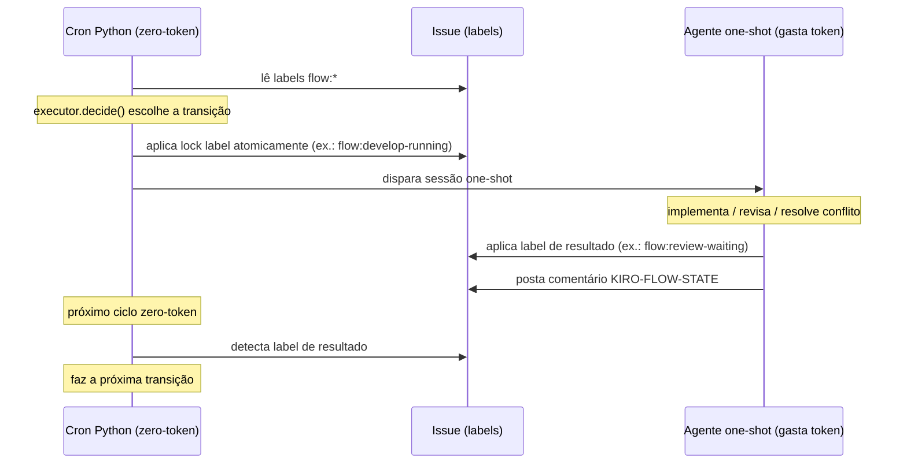

# KiroCrew Flow — Arquitetura

## Stack

| Item | Valor |
|---|---|
| Linguagem | Python 3.12 |
| Servidor web | aiohttp |
| Testes | pytest + pytest-cov |
| Linting | ruff |
| Type check | mypy |
| Cache do scan | SQLite (stdlib) |
| YAML | PyYAML com fallback para parser interno |

Sem FastAPI, Flask, Starlette ou Pydantic — o projeto segue a stack do próprio
Kiro Crew, validada lendo o código instalado.

## Padrão arquitetural: hexagonal (ports & adapters)

O motivo prático: a regra de negócio mais importante do fluxo (`can_leave_spec`)
fica testável **sem nenhuma infraestrutura** — nenhuma rede, nenhum banco, nenhum
mock de provider.

```
flow/
├── domain/    ← NÚCLEO: sem I/O, testável sem mock
├── ports/     ← contratos (Protocol)
├── adapters/  ← GitHub e Jira
├── scan/      ← zero-token polling
├── executor/  ← decisões por template
├── audit/     ← comentário de auditoria
└── config/    ← squad config + workflow templates
```

## Regra de isolamento do domínio

`test_domain_boundary.py` verifica por AST que nenhum arquivo em `flow/domain/`
importa infraestrutura. Se quebrar, pare tudo e conserte primeiro.

## Adapters são módulos, não classes

```python
_PROVIDERS = {"github": github_client, "jira": jira_client}
provider_for("jira")  # → o módulo jira_client
```

Um módulo não pode ser verificado estaticamente contra um `Protocol`. O gate que
garante conformidade é `test_provider_parity.py` — compara GitHub (referência)
contra Jira, com um auto-guard que falha se um terceiro adapter entrar no dispatch
sem ser registrado no teste.

Cada adapter tem três camadas:

| Camada | Papel |
|---|---|
| `*_transport.py` | I/O bruto — fachada patchável nos testes |
| `*_normalization.py` | payload do provedor → contrato canônico |
| `*_client.py` | orquestração; satisfaz `IssueProvider` |

O `github_client` expõe funções extras não presentes na porta:
- `get_pr_checks(project, pr_number)` — retorna os checks (CI) de um PR
- `upsert_pr_review_comment(...)` — cria ou atualiza comentário de review no PR
- `merge_pull_request(...)` — merge squash via API

Essas funções são GitHub-only e não fazem parte da porta `IssueProvider`.

## Identidade: projeto + issue key

A chave primária de um item de trabalho é **projeto + issue key** (`VGAT-123`).
O repo é derivado do título (`[repo] Descrição`), não da identidade.

O Jira é projeto-cêntrico por natureza. O GitHub é repo-cêntrico, mas a porta
normaliza para projeto para que o domínio seja agnóstico de provedor.

## Fluxo de uma issue pelo sistema

```
squads/my-squad.yaml
    → SquadConfig.resolve_workflow(labels)  → "hotfix-flow"
    → scan_candidates(config, provider, conn)  → [ScanResult]
    → executor.decide(result, state_comment)   → ExecutorDecision
    → provider.set_labels() + upsert_state_comment() + _dispatch()
```

O `deployment.py` é o **driving adapter** que executa esse loop como cron de
script do Kiro Crew (zero token no polling).

## Workspace isolado por task (Fase 2)

Cada dispatch cria um **worktree efêmero** dedicado, garantindo que múltiplas
tasks rodem em paralelo sem pisar uma na outra.

### Convenção de caminhos

```
<dev_root>/<repo-short>/          ← clone-base (nunca tocado diretamente)
<dev_root>/.esteira-worktrees/
    <repo-short>-<issue_number>/  ← worktree efêmero (criado no dispatch, removido no fim)
```

A função `_worktree_path(dev_root, repo, issue_number)` é a **fonte única de
verdade** do caminho: usada pelo `deployment.py` na limpeza pré-dispatch e pelo
prompt enviado à sessão one-shot. Os dois lados sempre falam do mesmo diretório.

### Fluxo pré-dispatch

```
scan_candidates()
    → executor.decide()
    → _resource_headroom_ok()        ← posture critical suspende dispatch
    → _clean_stale_worktree()        ← remove worktree órfão de sessão anterior
    → _issue_has_active_session()    ← mecanismo primário: worktree + PR + backstop
    → _is_dead_session()             ← detecta sessão morta pelo timeout longo
    → _dispatch()                    ← prompt inclui git worktree add no caminho canônico
```

### Cap de concorrência e detecção de sessão morta

A concorrência é decidida pelo **estado da issue**, não por lock de tempo:

- **Cap primário:** contagem de issues em `flow:develop-running` no scan atual — não locks de arquivo.
- **Backstop anti-duplo-dispatch:** lock de arquivo (2min) — protege o intervalo entre dispatch e o label chegar na API.
- **`_issue_has_active_session()`:** verifica worktree ativo, PR aberto na branch, e backstop lock — retorna `True` se qualquer sinal indicar sessão viva.
- **Detector de sessão morta (`_is_dead_session()`):** issue em running há >40min sem PR, sem worktree, sem backstop lock → sessão morta confirmada.
- **Recuperação fail-closed (`_recover_dead_session()`):** remove `flow:develop-running`, notifica TL, espera redespacho no próximo ciclo. Nunca redespacha sozinho em caso de ambiguidade.
- O headroom de recursos é verificado via `resource_status` do Kiro Crew antes de cada dispatch — posture `critical` adia sem bloquear o ciclo.

| Campo config | Função | Default |
|---|---|---|
| `max_concurrent_tasks` | Cap global de tasks em paralelo | `2` |
| `one_per_repo` | Reservado (não mais usado como guard primário) | `true` |

## Identificação e labels

O prefixo `flow:` é o namespace canônico de estado. O prefixo `crewflow:` é mantido
para metadado (tipo de fluxo, prioridade e `crewflow:blocked` por compatibilidade).
Confluence rejeita `:` — fora de escopo.

Estados (1 por vez, namespace `flow:*`):
```
flow:briefing → flow:planning-specs → flow:planning-review → flow:develop-waiting
  → flow:develop-running → flow:review-waiting → flow:review-approved
  → flow:qa-waiting → flow:qa-testing → flow:qa-approved → flow:done
```

> Labels de estado legadas (`crewflow:spec`, `crewflow:todo`, `crewflow:dev`, etc.)
> foram deprecadas — use `setup-flow-labels.sh` para novos repos.

Modificadores de estado (0..N, namespace `flow:*`):
```
flow:blocked         # para tudo (prioridade sobre o estado)
flow:merge-conflict  # PR com conflito — cron resolve via rebase
flow:review-running        # lock anti-loop de code review (interno)
```

Metadado (tipo e prioridade, namespace `crewflow:*`):
```
crewflow:feature / crewflow:bug / crewflow:hotfix / crewflow:debt
crewflow:p1 / crewflow:p2 / crewflow:p3
crewflow:blocked   # alias de flow:blocked, mantido por compatibilidade
```

## Protocolo cron ↔ agente

O motor é composto por **duas camadas distintas** que nunca se chamam
diretamente. Toda a coordenação acontece **exclusivamente via labels na issue**,
complementadas pelo comentário `KIRO-FLOW-STATE`.

### Camada 1: Cron Python (zero-token), orquestrador de estado

- Lê as labels `flow:*` da issue.
- Decide a transição de estado (`executor.decide()`, Python puro, sem I/O).
- Aplica a label de lock **atomicamente antes de despachar** (ex.: `flow:develop-running`,
  `flow:review-running`).
- Dispara a sessão one-shot do agente.
- No ciclo seguinte, detecta a label de resultado e faz a próxima transição.

O `deployment.py` é o driving adapter dessa camada e roda como cron de script do
Kiro Crew, sem gastar token no polling.

### Camada 2: Agente one-shot (gasta token), executor de trabalho

- Implementa, revisa ou resolve conflito de merge.
- Aplica a label de resultado ao terminar (ex.: `flow:review-waiting` ao abrir o PR,
  `flow:review-approved`/`flow:review-refused` após o review).
- Posta o comentário `KIRO-FLOW-STATE`.

A sessão recebe a issue já com a label de lock aplicada pelo cron (ver
`flow/prompts/develop_waiting.md`): o agente não troca a label de lock, apenas
aplica a label de resultado no fim.

### Regra de comunicação

Nenhuma das camadas chama a outra diretamente. O cron não fica esperando o agente,
e o agente não invoca o cron: a comunicação é **exclusivamente via labels na issue**
mais o comentário `KIRO-FLOW-STATE`. O cron detecta a label de resultado no próximo
ciclo zero-token e avança o estado.



### Responsável por cada label

Quem aplica cada label no protocolo: o cron aplica locks e transições
automatizadas; o agente aplica as labels de resultado do trabalho que executou.

| Label | Responsável | Significado |
|---|---|---|
| `flow:develop-waiting` | cron (detecta) | Gatilho único: o cron detecta e dispara a sessão de dev. |
| `flow:develop-running` | cron (aplica) | Lock de dev, aplicado atomicamente antes de despachar. |
| `flow:review-waiting` | agente (aplica) | Resultado do dev: PR aberto, aguardando reviewer. |
| `flow:review-running` | cron/reviewer (aplica) | Lock anti-loop de code review (uma análise por SHA). |
| `flow:review-approved` | agente (aplica) | Resultado do review: reviewer aprovou. |
| `flow:review-refused` | agente (aplica) | Resultado do review: reprovado (gate humano, sem redispatch). |
| `flow:merge-conflict` | cron (aplica) | `MARK_CONFLITO`: PR com conflito de merge ou base desatualizada. |
| `flow:blocked` | agente ou humano (aplica) | Parada: escopo vago, bypass sem justificativa ou decisão manual. |
| `flow:done` | cron (aplica) | Transição final após merge. |

## O comentário de estado

```markdown
<!-- KIRO-FLOW-STATE -->
## 🤖 KiroCrew Flow — Estado

**Workflow:** feature (v1)
**Nó atual:** review
**Status:** running
**Repo:** api-gateway2

### Histórico
| Quando | De → Para | Quem |
|--------|-----------|------|
| 2026-09-15 00:02 | start → dev | system |

### Exceções
| Exceção | Justificativa | Quem | Quando |
|---------|---------------|------|--------|
| `hml-bypass` | Checkout fora do ar | @elias | 2026-09-15 |
<!-- /KIRO-FLOW-STATE -->
```

O comentário não é só registro — é **fonte de pré-condições de merge**. O executor
bloqueia o merge com `hml-bypass` se a seção de Exceções não tiver
justificativa preenchida.

## Protocolo cron ↔ agente

O mecanismo de comunicação do sistema é **exclusivamente via labels de issue**. Cron
Python e agente LLM nunca se chamam diretamente — toda a troca de estado acontece
pelas labels `flow:*` aplicadas na issue.

### Duas camadas com responsabilidades distintas

| Camada | Execução | Responsabilidade |
|---|---|---|
| **Cron Python** | zero token | Lê labels → decide → aplica lock label → dispara sessão |
| **Agente one-shot** | gasta token | Implementa/revisa → aplica label de resultado → posta comentário |

### Diagrama do protocolo

```
Cron Python (zero token)          Issue (labels)       Agente one-shot
deployment.py                     GitHub / Jira        (gasta token)

scan_candidates()
     │
     ▼ detecta flow:develop-waiting
executor.decide()
     │ → DISPATCH_DEV
     ▼
set_labels()  ──────────► [ flow:develop-running ]
     │                              │
_dispatch() ─────────────────────► │ inicia sessão one-shot
                                   │
                                   ├─ implementa
                                   ├─ abre PR
                                   ├─ posta KIRO-FLOW-STATE comment
                                   │
                                   ▼
                     [ flow:review-waiting ]  ◄── agente aplica label
                                                   antes de encerrar

scan_candidates()  ◄──── cron detecta mudança de label
     │ detecta flow:review-waiting
     ▼
DISPATCH_REVIEWER → set_labels() → [ flow:review-running ]
     │
_dispatch() ─────────────────────► sessão one-shot (reviewer)
                                   │
                       aprovado:   ▼
                     [ flow:review-approved ]  ◄── agente aplica label
```

### Tabela de labels — responsável e significado

| Label | Quem aplica | Quando | Significado |
|---|---|---|---|
| `flow:briefing` | 🧠 humano | ao criar a demanda | TL/PM abriu a task |
| `flow:planning-specs` | 🧠 dev | ao iniciar spec | Dev montando critérios |
| `flow:planning-review` | 🧠 dev | ao pedir revisão | Aguardando aprovação humana |
| `flow:develop-waiting` | 🧠 humano | ao priorizar | **Gatilho do cron** — próxima no scan |
| `flow:develop-running` | 🤖 cron | ao despachar dev | Lock atômico antes de abrir sessão |
| `flow:review-waiting` | 🤖 agente (dev) | ao abrir PR | Agente sinalizou que terminou |
| `flow:review-running` | 🤖 cron | ao despachar reviewer | Lock anti-loop por SHA |
| `flow:review-approved` | 🤖 agente (reviewer) | ao aprovar | Cron lê e avança para QA |
| `flow:review-refused` | 🤖 agente (reviewer) | ao reprovar | Gate humano — fluxo para |
| `flow:qa-waiting` | 🤖 cron | após merge/review-ok | Aguardando QA manual |
| `flow:qa-testing` | 🧠 QA | ao iniciar testes | QA sinalizou que está testando |
| `flow:qa-approved` | 🧠 QA | ao aprovar | Gatilho de merge (se auto-merge) |
| `flow:qa-refused` | 🧠 QA | ao reprovar | Gate humano — fluxo para |
| `flow:done` | 🤖 cron | após merge final | Issue concluída |
| `flow:blocked` | 🧠 humano ou 🤖 agente | ao detectar bloqueio | Para tudo — prioridade sobre estado |
| `flow:merge-conflict` | 🤖 cron | ao detectar conflito | Dispara sessão de resolução |

> **Regra para o agente:** o agente one-shot nunca inicia uma sessão de outro agente
> diretamente. Ao terminar, ele aplica a label de resultado (`flow:review-waiting`,
> `flow:review-approved`, `flow:review-refused`, `flow:blocked`) e posta o comentário
> `<!-- KIRO-FLOW-STATE -->`. O cron detecta a mudança no próximo ciclo e age.

### Contrato de encerramento do agente

Todo agente one-shot deve, ao encerrar com sucesso:

1. Aplicar a label de resultado (ex: `flow:review-waiting`) e remover a de estado anterior (ex: `flow:develop-running`).
2. Postar o comentário `<!-- KIRO-FLOW-STATE -->` com o histórico da transição.
3. **Nunca chamar o cron, o próximo agente ou o webhook diretamente** — a label é o único canal de sinalização.

Ao encerrar por bloqueio:

1. Aplicar `flow:blocked`.
2. Remover o estado anterior (`flow:develop-running`, `flow:review-running`, etc.).
3. Comentar o motivo do bloqueio na issue.

Diagrama de sequência completo: [`docs/fluxo.md`](fluxo.md).

## Detalhes técnicos: para desenvolvedores

Ver `.kiro/steering/arquitetura.md` — cobre convenções de código (StrEnum,
`slots=True`, imports no topo, `with` múltiplos), como adicionar um novo
provedor, e como rodar o CI localmente.
