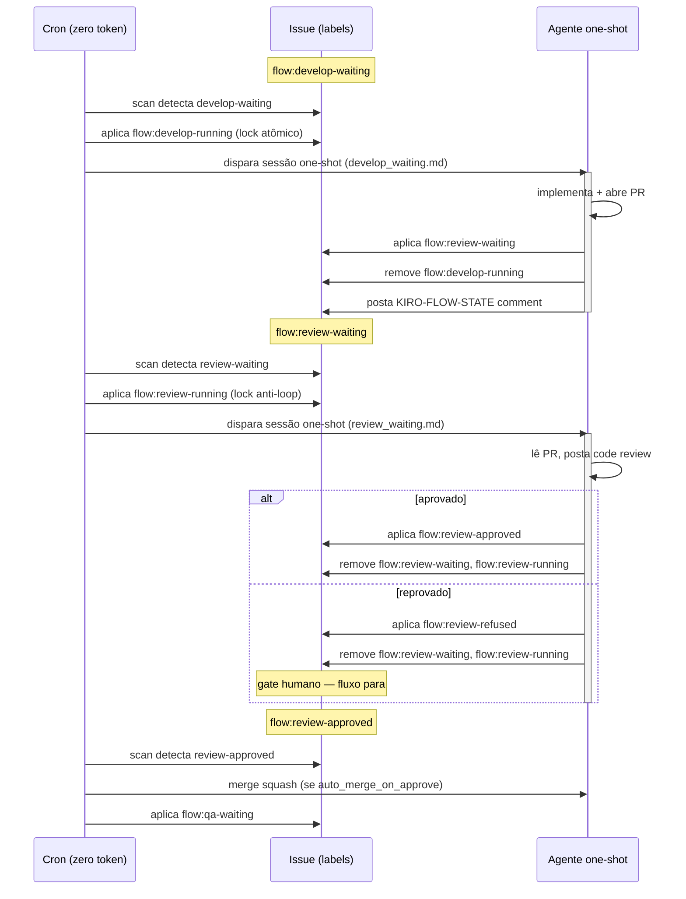

# KiroCrew Flow — Diagrama de sequência

## Protocolo cron ↔ agente via labels de issue

O mecanismo central do sistema é o **canal de comunicação assíncrono via labels de
issue**. Cron Python e agente LLM nunca se chamam diretamente — toda a troca de
estado acontece por meio das labels `flow:*` aplicadas na issue.

```
┌───────────────────────────────────────────────────────────────────────────┐
│  Cron Python (zero token)          Issue (labels)       Agente one-shot   │
│  deployment.py                     GitHub / Jira        (gasta token)      │
└───────────────────────────────────────────────────────────────────────────┘

     scan_candidates()
          │
          ▼ detecta flow:develop-waiting
     executor.decide()
          │ → DISPATCH_DEV
          ▼
     set_labels()  ──────────► [ flow:develop-running ]
          │                              │
     _dispatch() ─────────────────────► │ inicia sessão one-shot
                                        │
                                        ├─ implementa
                                        ├─ abre PR
                                        ├─ posta KIRO-FLOW-STATE comment
                                        │
                                        ▼
                          [ flow:review-waiting ]  ◄── agente aplica label
                                                        antes de encerrar

     scan_candidates()  ◄──── cron detecta mudança de label
          │
          ▼ detecta flow:review-waiting
     DISPATCH_REVIEWER
          │
     set_labels()  ──────────► [ flow:review-running ]
          │
     _dispatch() ─────────────────────► sessão one-shot (reviewer)
                                        │
                                        ├─ lê PR e comentários
                                        ├─ posta review comment
                                        │
                            aprovado:   ▼
                          [ flow:review-approved ]  ◄── agente aplica label
                         (remove flow:review-running,
                                 flow:review-waiting)

     scan_candidates()  ◄──── cron detecta flow:review-approved
          │
          ▼ MERGE_PR (se auto_merge_on_approve)
     merge squash  ──────────► [ flow:qa-waiting ] → … → [ flow:done ]
```

### Ponto-chave: comunicação exclusivamente via labels

Nenhuma das partes chama a outra diretamente:

- O **cron** lê labels → decide → aplica label de lock → dispara sessão.
- O **agente** implementa → aplica label de resultado → posta comentário → encerra.
- O **cron** detecta a label de resultado → faz a próxima transição.

Isso torna o sistema tolerante a falhas e auditável: o estado da issue em qualquer
momento é suficiente para diagnosticar onde o fluxo parou.

---

## Diagrama Mermaid — sequência completa (feature flow)



---

## Fluxos disponíveis

Os quatro templates da Fase 1 têm variações nessa sequência. Os diagramas de cada
fluxo ficam em [`docs/diagramas/`](diagramas/README.md).

| Template | Arquivo fonte Mermaid |
|---|---|
| Feature (Versão C) — oficial | [`resources/mermaid/fluxo-feature-versao-c.mmd`](../resources/mermaid/fluxo-feature-versao-c.mmd) |
| Bug | [`resources/mermaid/fluxo-bug.mmd`](../resources/mermaid/fluxo-bug.mmd) |
| Hotfix | [`resources/mermaid/fluxo-hotfix.mmd`](../resources/mermaid/fluxo-hotfix.mmd) |
| Débito técnico | [`resources/mermaid/fluxo-debito-tecnico.mmd`](../resources/mermaid/fluxo-debito-tecnico.mmd) |
