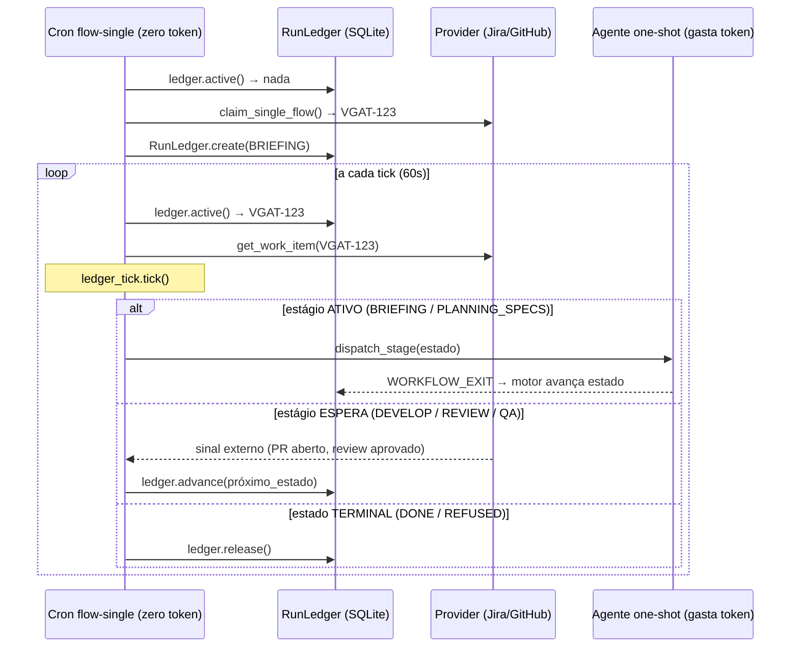

# KiroCrew Flow — Sequência (single-flow, ledger-driven)

## Visão geral

O motor é **ledger-driven**: o estado de cada task vive num SQLite local
(`run_ledger`), não nas labels da issue. A cron `flow-single` (60s) executa um
tick O(1) — 1 query SQLite + 1 chamada de rede.

```
Cron flow-single (60s, zero token)
  │
  ├─ deployment.run_single_flow(ctx)
  │       └─ ledger.active()          ← 1 query SQLite
  │           sem task ativa?
  │               └─ claim_single_flow() ← reclamar próxima issue
  │
  ├─ ledger.active() → task VGAT-123, estado=BRIEFING
  │   provider.get_work_item(issue_key) ← 1 chamada de rede (estado real)
  │   ledger_tick.tick(ledger, work_item, dispatcher)
  │       └─ estágio ATIVO → dispatch_stage(BRIEFING)
  │                           ─────────────────────► sessão one-shot aberta
  │                                                   Agente: monta contexto
  │                                                   WORKFLOW_EXIT: {done}
  │       └─ ledger avança: BRIEFING → PLANNING_SPECS
  │
  └─ … (ticks seguintes)
```

## Jornada completa de uma task

### 1. Claim (reclamação da issue)

`claim_single_flow()` busca a próxima issue no provider (Jira ou GitHub) com o
critério configurado no squad config e cria o `RunLedger`:

```python
ledger = RunLedger.create(
    issue_key="VGAT-123",
    state=State.BRIEFING,
    squad_id="my-squad",
)
```

A partir daqui o estado vive no SQLite — a issue do Jira/GitHub é lida apenas
como sinal externo (existe PR? review aprovado?).

### 2. BRIEFING

- Motor: estágio ativo → `dispatch_stage(BRIEFING)`.
- Sessão one-shot abre, agente lê o contexto da issue, monta objetivo e critérios.
- Agente publica `WORKFLOW_EXIT: {"exit_status": "done"}` na última mensagem.
- Motor lê o JSONL da sessão → avança: `BRIEFING → PLANNING_SPECS`.

### 3. PLANNING_SPECS

- Motor: estágio ativo → `dispatch_stage(PLANNING_SPECS)`.
- Sessão one-shot: agente escreve spec detalhada, sub-tasks e critérios de aceite.
- Agente publica `WORKFLOW_EXIT: {"exit_status": "done"}`.
- Motor avança: `PLANNING_SPECS → PLANNING_REVIEW`.

### 4. PLANNING_REVIEW (gate humano)

- Motor: aguarda sinal externo de aprovação da spec pelo TL/PM.
- Nenhuma sessão é disparada — o motor fica em `waiting`.
- Humano aprova → motor avança: `PLANNING_REVIEW → DEVELOP_WAITING`.

### 5. DEVELOP_WAITING

- Motor: aguarda PR aberto.
- Dev pega a task, abre branch e implementa (fora do motor).
- PR detectado → motor avança: `DEVELOP_WAITING → REVIEW_WAITING`.

### 6. REVIEW_WAITING

- Motor: aguarda review aprovado.
- Review aprovado no PR → motor avança: `REVIEW_WAITING → QA_WAITING`.
- Review reprovado → motor transiciona para `REVIEW_REFUSED` (terminal, gate humano).

### 7. QA_WAITING

- Motor: aguarda QA.
- QA aprova → motor avança: `QA_WAITING → DONE`.
- QA reprova → motor transiciona para `QA_REFUSED` (terminal, gate humano).

### 8. DONE

- `ledger.release()` — slot liberado para a próxima task.
- Labels `flow:done` aplicadas na issue.
- Issue fechada pelo agente ou pelo merge do PR (dependendo da config).

## Diagrama Mermaid



## Protocolo WORKFLOW_EXIT

O agente one-shot sinaliza o resultado publicando na última mensagem do turno:

```
WORKFLOW_EXIT: {"exit_status": "done"}
```

O motor lê o arquivo `.jsonl` da sessão de trás para frente, extrai o último
`WORKFLOW_EXIT` e mapeia o `exit_status` para o próximo estado conforme o YAML do
workflow (quando o engine de workflow por nós tipados estiver ativo) ou a tabela
`_NEXT_STATE` do `ledger_tick.py`.

## Comparação com o modelo legado (label-driven)

| Aspecto | Legado (até set/2026) | Atual (ledger-driven) |
|---|---|---|
| Estado canônico | Labels `flow:*` na issue | SQLite (`run_ledger.state`) |
| Custo do tick | O(n): scan de todas as issues | O(1): 1 query SQLite |
| Crons | 8 crons por estágio + 1 monolítico | 1 cron (`flow-single`) |
| Comunicação cron↔agente | Labels na issue + `KIRO-FLOW-STATE` comment | `WORKFLOW_EXIT` no JSONL da sessão |
| Estado de sessão | Lock files + worktree check | `session_key` (tab_id) no ledger |

O código legado foi removido na PR #319 (out/2026). Labels `flow:*` continuam
sendo aplicadas como espelho de visibilidade, mas não são mais a fonte de verdade.
